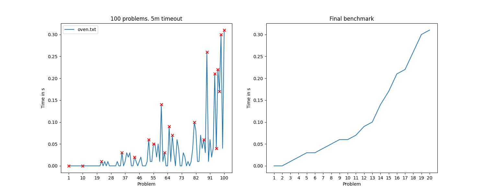
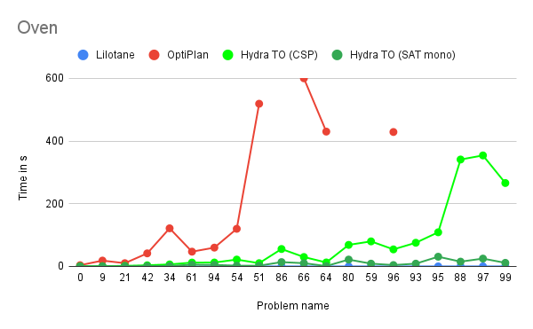
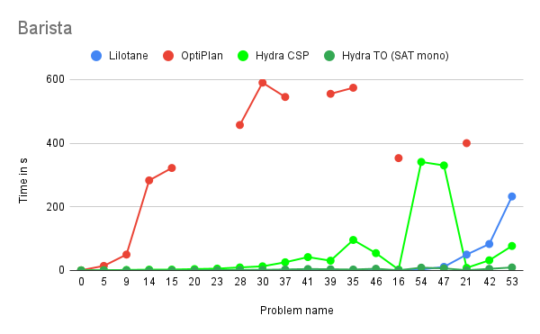
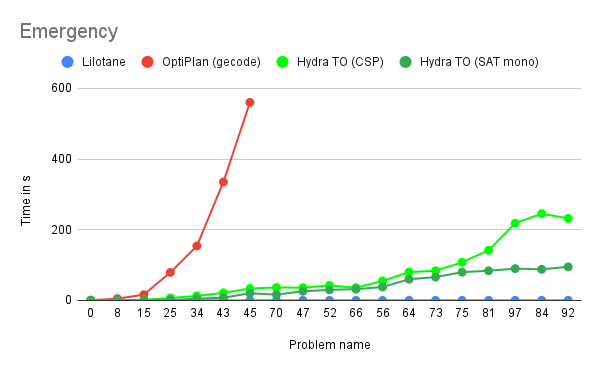
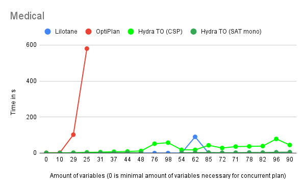
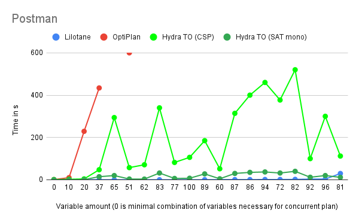
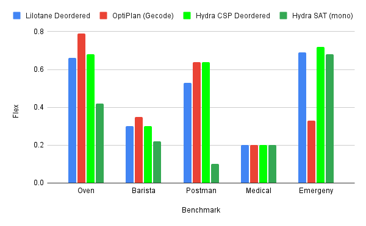

# po-benchmarks
For each problem type, 100 problems, with progressively increased number of variables, was generated.
These problems have been solved using Lilotane, after which 20 problems with progressively increased solve time have been selected.

For each benchmark, a chart of type **XXX_selection.png** was generated.
An example of the chart for oven benchmark:

100 problems were generated using a python generator, which consists of 2 files:
**generator.py** and **instance_generator.py**

**instance_generator.py** is responsible for generating a single problem file based on variable parameters. **generator.py** chooses parameters for 100 problems and calls **instance_generator.py**

**XXX_times.png** indicates solve time comparisons for Lilotane and OptiPlan.
Below you can find an example of the chart (timeout at 10 minutes):

Finally, you can see the flex comparison between deordered Lilotane and POP OptiPlan. Note, **flex = 1** indicates fully concurrent plan, **flex = 0** indicates fully sequential plan.

